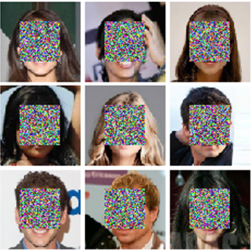
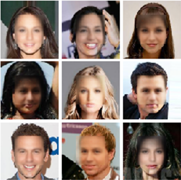
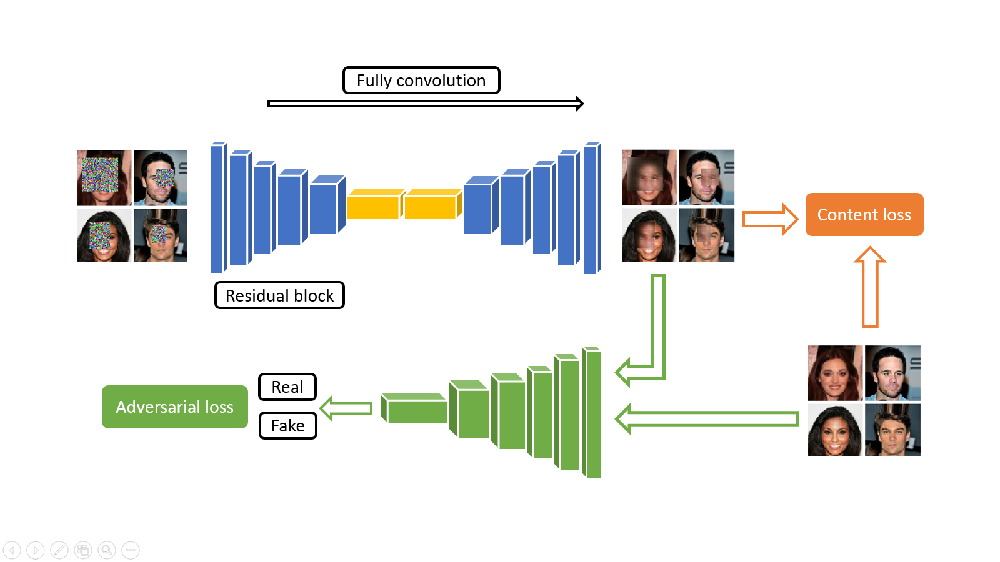
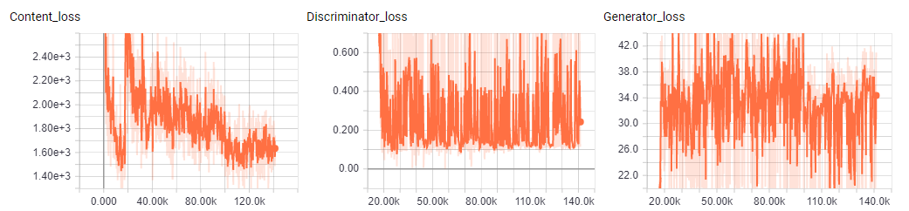
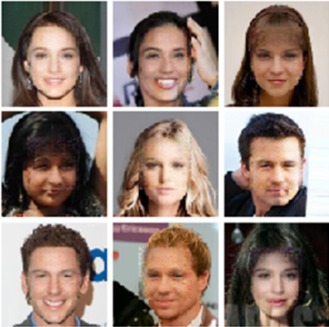

# Face Completion
## Overview
A TensorFlow implementation using residual convolution autoencoder with/without discriminator for Face Completion

## Dataset
* Use [**CELEBA**](http://mmlab.ie.cuhk.edu.hk/projects/CelebA.html)  
* Generate noise at center (64x64) in utils.py
* Data path
  ```
  -Face-Completion
    -autoencoder
      -data
        -train
        -test
    -autoencoder-gan
      -data
        -train
        -test
  ```

## Requirements
* Python == 2.7
* Tensorflow == 1.4 
* Skimage
* Matplotlib == 2.0.0

## Autoencoder  
### Run    
* Load pre-trained  
Put [checkpoint files](https://drive.google.com/drive/folders/1aFRcOunF2WOcjL0nBdBYtAWs0u_ksUsr?usp=sharing) under ./autoencoder/model folder and set restore=True

* Train and test
```
python main.py
--epoch 
--batch_size
--data_path=./data
--model_path=./model
--output_path=./out
--graph_path=./graph
--restore=False
--mode=train/test
```

* Visualization
```
tensorboard --logdir=./graph
```

### Result
 

## Autoencoder + GAN
### Run

* Train and test
```
python main.py
--epoch 
--batch_size
--data_path=./data
--model_path=./model
--output_path=./out
--graph_path=./graph
--restore=False
--mode=train/test
```

* Visualization
```
tensorboard --logdir=./graph
```

### Network


### Loss


### Result
 
