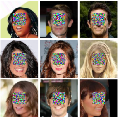
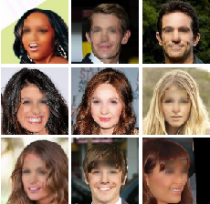

# CEDL_FINAL Face Completion
## Dataset
* Use **CELEBA** `img_align_celeba 000001~111157.jpg` as training data, else as testing data  
* The path under THOR is `/media/VSlab3/guy/autoencoder/data`
## Autoencoder  
### Run    
* Load pre-trained  
Put [checkpoint files](https://drive.google.com/drive/folders/1aFRcOunF2WOcjL0nBdBYtAWs0u_ksUsr?usp=sharing) under ./autoencoder/model folder and set restore=True 
```
python main.py
--epoch 
--batch_size
--data_path
--model_path
--output_path
--graph_path
--restore
--mode
```
### Result
 

## Autoencoder + GAN
### Run
```
python main.py
--epoch 
--batch_size
--data_path
--model_path
--output_path
--graph_path
--restore
--mode
```
### Network
  
